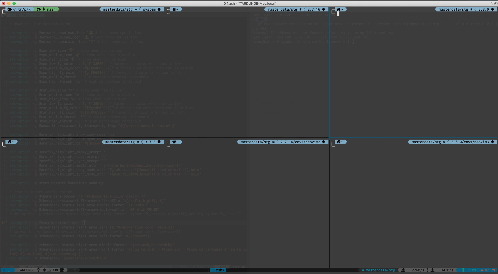

# kmux-status
tmux status-lline plugin to render kube-context and other indicators



# Features
- Adds kube-context with namespace to the status-line.

# Installation

If you are using zsh and tmux with kubecontext on you shell RightPrompt, but you deal with one kube-context at a time accross terminals, while rotating configs over time, then it makes sense to have the kubecontext indicated on tmux status-line rather than having it rendered across all your terminal prompts.

## Requirements

- [`kubectl`](https://kubernetes.io/docs/tasks/tools/install-kubectl/) binary.

**Note:** Please use this command to check whether tmux is able to find kubectl: `tmux run-shell -b 'command -v kubectl'`

## Install via [TPM](https://github.com/tmux-plugins/tpm/)

Add this line to your `~/.tmux.conf`

```tmux
set -g @plugin 'tardunge/kmux-status'
```

Reload configuration, then press `prefix` + `I` to install plugin.

# Usage

```tmux
# in .tmux.conf
set-option -g status-right '#{@kmux-kcontext-icon} #{kcontext}'
```

# Customization

Here are available options with their default values:

```tmux
# in .tmux.conf
set-option -g @kmux-kcontext-icon "⎈"
```

# License

[MIT](https://github.com/tardunge/kmux-status/blob/main/LICENSE)
